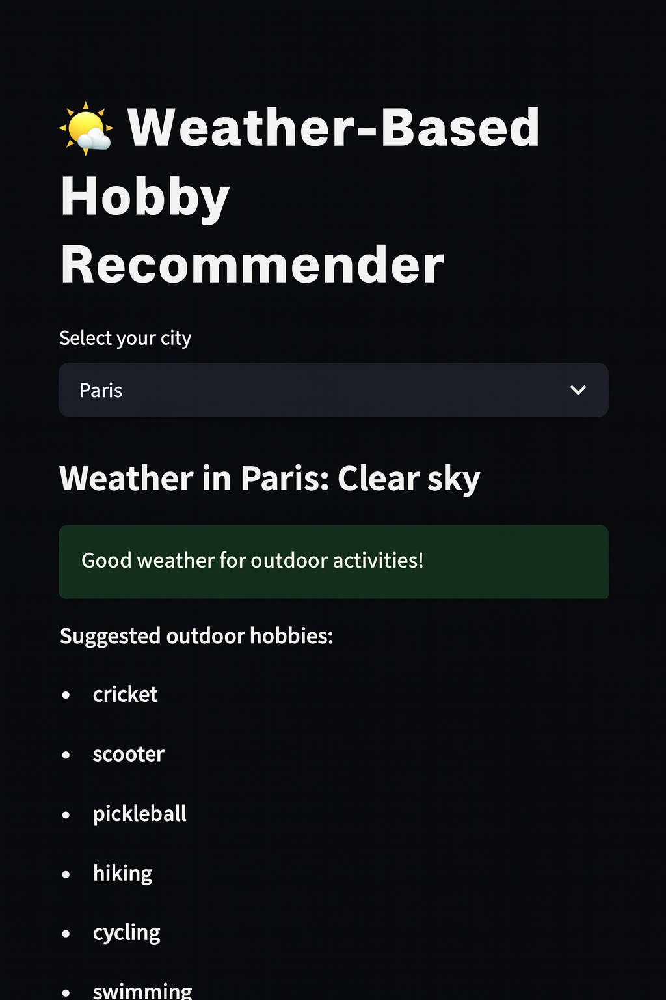

# 🌤️ Weather-Based Hobby Recommender

This project is a **Streamlit web app** that recommends indoor or outdoor hobbies based on the current weather conditions in a selected city.

---

## 🚀 Features
- Select your city from a dropdown list.
- Displays the current weather condition.
- Suggests outdoor hobbies for good weather.
- Suggests indoor hobbies when the weather is not suitable for outdoor activities.

---

## 📸 Screenshot



---

## 🛠️ Installation


Install dependencies:
```bash
pip install -r requirements.txt
```

Run the app:
```bash
streamlit run app.py
```

---

## 📂 Project Structure
```
weather-hobby-recommender/
│-- app.py               # Main Streamlit app
│-- weather_data.csv     # Example weather dataset
│-- hobbies_master.csv   # Master list of hobbies
│-- requirements.txt     # Dependencies
│-- assets/
│   └── screenshot.png   # App screenshot
│-- README.md            # Project README
│-- LICENSE              # License file
```

---

## 📊 Example Data Format

**weather_data.csv**
```
City,Description
Paris,Clear sky
London,Rain
New York,Cloudy
```

**hobbies_master.csv**
```
hobby,type
cricket,outdoor
cycling,outdoor
swimming,outdoor
reading,indoor
painting,indoor
chess,indoor
```

---

## 📜 License
This project is licensed under the MIT License - see the [LICENSE](LICENSE) file for details.
